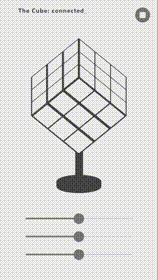

# Cube


Этот проект вдохновлён Максимом из команды Машинаторов, к которому обратилась компания Mundfish, разрабатывающая RPG-шутер The Cube, с задачей построить реплику их куба.

Данное приложение можно развить в полноценную систему для управления реальным кубом — например, через WebSocket или Bluetooth Low Energy (BLE), чтобы отправлять команды и получать данные с устройства.

Визуализация выполнена на Flutter Desktop (тестировалась на Windows).



## Запуск

1. Установите Flutter (рекомендуется последняя стабильная версия).
2. Клонируйте репозиторий:
   ```sh
   git clone <repo-url>
   cd cube
   ```
3. Получите зависимости:
   ```sh
   flutter pub get
   ```
4. Запустите на Windows:
   ```sh
   flutter create --platforms windows --empty .
   flutter run -d windows
   ```

## Управление
- Используйте слайдеры для задания скоростей вращения.
- Кнопка в правом верхнем углу сбрасывает положение кубов.
- Статус в левом верхнем углу меняется автоматически для демонстрации анимации.

## Зависимости
- Только стандартные пакеты Flutter и vector_math.
